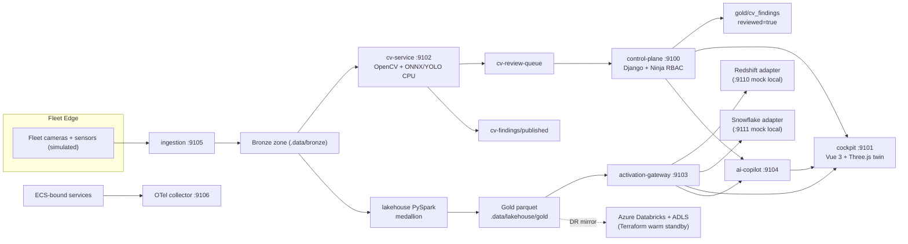

# PRISM architecture

PRISM is a visual fleet-intelligence platform: edge telemetry and imagery flow into a lakehouse, CV findings enrich silver/gold, and a single activation contract fans gold data into Redshift and Snowflake. A Django control plane and Vue 3 + Three.js cockpit sit on top; an AI copilot answers only from tool calls.

Local day-to-day path is `docker compose` / `make demo` (zero cloud credentials). AWS and Azure Terraform are validate/plan/checkov only in CI ([ADR-001](docs/adr/001-cost-safety-policy.md)).

## System diagram

A trimmed overview also appears at the top of [README.md](README.md). Full graph:

## Layers

| Layer | Technology | Role |
|---|---|---|
| Ingestion | Simulator + file/LocalStack Kinesis | Fleet camera frames + sensor pings → bronze |
| Object storage | S3 (AWS) / `.data` (local) | Raw, gold, static assets |
| Lakehouse | PySpark medallion; Databricks/UC in target arch | Bronze → silver → gold |
| Modeling | dbt Core | Silver → gold tests (DuckDB in CI) |
| Serving WH #1 | Redshift Serverless (mock `:9110` local) | Gold activation |
| Serving WH #2 | Snowflake Horizon (mock `:9111` local) | Same gold, zero-copy mode |
| DR | Azure Databricks + ADLS Gen2 | Warm-standby mirror ([ADR-003](docs/adr/003-azure-dr-two-cloud-tradeoff.md)) |
| CV | OpenCV + ONNX Runtime YOLO-family (CPU) | Defect / anomaly detection |
| Control plane | Django 5 + Ninja + Django-Q2 | Assets, WOs, review, RBAC, audit |
| Frontend | Vue 3 + Three.js WebGPURenderer | Digital-twin cockpit |
| Copilot | Tool-grounded FastAPI | Ask PRISM — no fabrication ([ADR-004](docs/adr/004-copilot-non-fabrication.md)) |
| Compute | ECS Fargate + Service Connect | Stateless services (Terraform) |
| OLTP | RDS PostgreSQL Multi-AZ (SQLite local) | Control-plane store |
| Observability | OpenTelemetry + CloudWatch LES | Fleet traces + per-service dashboards/alarms |
| IaC | Terraform AWS + Azure | Plan/validate/checkov in CI; human apply |

## Contracts

Cross-service schemas live under `contracts/` and are imported, never copied:

- `telemetry-schema` — `SensorPing` + `CameraFrameMetadata`
- `cv-finding-schema` — `CvFinding` (`PRISM-AST-###`, `frm_*`, `fnd_*`)
- `activation-contract` — `POST /v1/activate`, `POST /v1/query` OpenAPI

## Golden path (Phase 11)

One automated chain in `tests/e2e/test_golden_path.py` (live compose, `PRISM_E2E=1`):

1. Simulated fleet event accepted by **ingestion** into bronze  
2. **cv-service** emits a schema-valid finding into the **review queue** (demo threshold 0.99)  
3. **control-plane** inspector approves → `lakehouse/gold/cv_findings/<id>.json` with `reviewed=true`  
4. Gold metrics parquet updated → **activation-gateway** serves the same `ping_count` from **Redshift and Snowflake** adapters  
5. **Cockpit** proxies see the asset + finding  
6. **Ask PRISM** returns a grounded answer citing tool evidence  

Operator entrypoint: `make demo` then `make e2e`. Talk track: [docs/DEMO_SCRIPT.md](docs/DEMO_SCRIPT.md).

## Path summaries by phase

| Phase | Path |
|------:|------|
| 1 | Simulator → contract gate → bronze Hive partitions / DLQ |
| 2 | Bronze → Spark silver/gold parquet; UC bootstrap structural; dbt DuckDB |
| 3 | Frames → ONNX YOLO CPU → publish or review-queue by confidence |
| 4 | Gold → activation-gateway → Redshift + Snowflake behind one contract ([ADR-002](docs/adr/002-multi-warehouse-activation.md)) |
| 5 | Review queue files → RBAC decide → gold writeback + audit |
| 6 | AWS Terraform: VPC, ALB+WAF, ECS, RDS, S3, KMS, Secrets+rotation, IAM, observability |
| 7 | Azure DR Terraform + failover runbook ([ADR-003](docs/adr/003-azure-dr-two-cloud-tradeoff.md)) |
| 8 | Cockpit twin on `:9101` (WebGPU/WebGL, incident scrubber) |
| 9 | Ask PRISM tool-grounded copilot ([ADR-004](docs/adr/004-copilot-non-fabrication.md)) |
| 10 | OTel through ECS-bound services; CW LES dashboards/alarms; IAM/WAF audits; secrets rotation |
| 11 | Demo seed, golden-path e2e, screenshots, finalized docs |

## Host ports (9100–9199)

| Port | Service |
|-----:|---------|
| 9100 | control-plane |
| 9101 | cockpit |
| 9102 | cv-service |
| 9103 | activation-gateway |
| 9104 | ai-copilot |
| 9105 | ingestion |
| 9106 | OTel collector (OTLP HTTP) |
| 9110 / 9111 | mock Redshift / Snowflake |
| 9199 | foundation stub |

## ADRs

See [docs/adr/index.md](docs/adr/index.md) — four accepted ADRs covering cost safety, multi-warehouse activation, Azure DR tradeoff, and copilot non-fabrication.

## Cost safety

[ADR-001](docs/adr/001-cost-safety-policy.md). CI never applies Terraform, never calls paid APIs, never runs GPU inference. Emulators: DuckDB, LocalStack, mock warehouses, SQLite, CPU ONNX.
