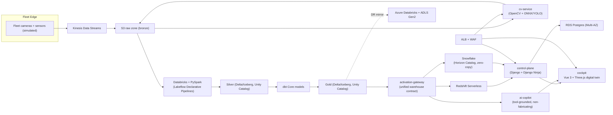

# PRISM architecture

PRISM is a visual fleet-intelligence platform: edge telemetry and imagery flow into a Databricks lakehouse, CV findings enrich the silver/gold layers, and a single activation contract fans gold data into Redshift and Snowflake. A Django control plane and Vue 3 + Three.js cockpit sit on top; an AI copilot answers only from tool calls.

## System diagram

## Layers

| Layer | Technology | Role |
|---|---|---|
| Ingestion | Kinesis (+ local shim) | Fleet camera frames + sensor pings |
| Object storage | S3 | Raw zone, table storage, static assets |
| Lakehouse | Databricks (PySpark, Unity Catalog, Lakeflow Declarative Pipelines) | Bronze → silver → gold |
| Modeling | dbt Core | Silver → gold tests, docs, lineage |
| Serving WH #1 | Redshift Serverless | Gold activation (zero-ETL / auto-copy) |
| Serving WH #2 | Snowflake Horizon Catalog | Iceberg zero-copy read |
| DR | Azure Databricks + ADLS Gen2 | Warm-standby mirror |
| CV | OpenCV + ONNX Runtime (YOLO-family) | Defect / anomaly detection |
| Control plane | Django 5.x + Django Ninja | Assets, work orders, review, RBAC |
| Frontend | Vue 3 + Three.js WebGPURenderer | Digital-twin cockpit |
| Copilot | Tool-grounded NL service | Ask PRISM — no fabrication |
| Compute | ECS Fargate + Service Connect | Stateless services |
| OLTP | RDS PostgreSQL Multi-AZ | Control-plane store |
| IaC | Terraform | AWS + Azure; plan/validate in CI only |

## Contracts

Cross-service schemas live under `contracts/` and are imported, never copied:

- `telemetry-schema` — `SensorPing` + `CameraFrameMetadata` (Pydantic + JSON Schema)
- `cv-finding-schema` — `CvFinding` defect/anomaly findings (Pydantic + JSON Schema; emitter in Phase 3)
- `activation-contract` — warehouse-agnostic activate/query OpenAPI (Phase 4)

## Ingestion path (Phase 1)

Mock fleet simulator → contract gate → stream producer (`file` default or LocalStack Kinesis) → Hive-partitioned bronze zone under `.data/bronze/{sensor_pings|camera_frames}/dt=…/device=…/`. Rejected events land in `.data/bronze/_dlq/`.

## Lakehouse path (Phase 2)

Bronze JSON → PySpark silver (typed, expectation-filtered, deduped) → gold aggregates, written as parquet under `.data/lakehouse/{silver,gold}/`.  
Data-quality expectations live in `lakehouse/quality/expectations.yaml` and are applied as Unity Catalog table properties (`quality.expectation.*`) via `unity_catalog/bootstrap.sql` (manual workspace apply). Lakeflow Declarative Pipelines reference those property keys.  
dbt Core models silver→gold for analytics tests (DuckDB in CI; Databricks SQL warehouse profile documented for real runs).

## Cost safety

See [ADR-001](docs/adr/001-cost-safety-policy.md). Local path uses Docker Compose + emulators (DuckDB, LocalStack, moto). CI validates Terraform; humans apply.

## Build order

Phases 0 → 11 are documented in the build brief and tracked via `PHASE_N_COMPLETION.md` files at the repo root. Phase 0 scaffolds the monorepo, rules, CI, contract stubs, and empty Terraform roots only.
