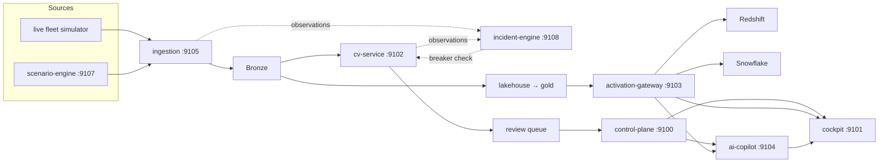

# PRISM

**Visual Fleet Intelligence & Multi-Warehouse Analytics Platform.**



## Quick start

Go from a fresh clone to a working digital-twin demo in your browser in under five minutes. You only need **Docker Desktop (or equivalent) running** — no cloud accounts, no API keys, no GPU.

1. **Clone the repo and enter it.** This is the only setup step outside Docker.

   ```bash
   git clone https://github.com/hamidmatiny/PRISM.git
   cd PRISM
   ```

2. **Confirm Docker is up.** `docker info` should succeed without errors; if it fails, start Docker and retry before continuing.

   ```bash
   docker info >/dev/null
   ```

3. **Start the seeded demo stack.** `make demo` builds and starts the services, waits until the cockpit is healthy, activates the warehouses, and prints a **viewer token** at the end (usually under five minutes the first time images build).

   ```bash
   make demo
   ```

4. **Open the cockpit and sign in.** Visit [http://127.0.0.1:9101](http://127.0.0.1:9101), paste the viewer token from the `make demo` output into the **API token** field, and click **Use token**.

5. **Confirm it worked.** You should see a dark **PRISM** shell with a 3D fleet floor of assets, at least one asset showing health driven by open work orders / CV findings, and an **Ask PRISM** panel you can open for tool-grounded answers. Click an asset for telemetry, CV findings, and work-order detail.

No cloud credentials are required ([ADR-001](docs/adr/001-cost-safety-policy.md)). Longer talk track: [docs/DEMO_SCRIPT.md](docs/DEMO_SCRIPT.md). Optional proof after the demo is up: `PRISM_E2E=1 pytest -q tests/e2e -m e2e`.

### Local (non-Docker) test setup

`make demo` above is the fastest path to a working system and needs nothing but Docker. Running the Python unit suite (`make test`) *outside* Docker — e.g. to iterate on a single service — needs a real local Python environment, which the quick start above intentionally does not require. If you only ever use `make demo`, skip this section.

Prerequisites:

- **Python 3.12+** (`python3.12 -V`). `make setup` installs everything into whatever `python`/`pip` is first on your `PATH`, so activate a 3.12 virtualenv first — don't let it fall through to your OS's default Python.
- **Java 17** — needed only to *launch* a local Spark session for one lakehouse test (`test_medallion_local_spark`). PySpark itself imports fine without Java; only starting the JVM gateway needs it. CI always has Java via `actions/setup-java`. Without it locally, that one test skips cleanly instead of failing (Phase 13). To install: `brew install openjdk@17 && sudo ln -sfn $(brew --prefix openjdk@17)/libexec/openjdk.jdk /Library/Java/JavaVirtualMachines/openjdk-17.jdk` (macOS/Homebrew) or your OS's Temurin 17 package.
- **Node 22+** — only needed for `make cockpit-build` / `make phase8-check` and later phase-check targets that build the cockpit.

Setup:

```bash
python3.12 -m venv .venv
source .venv/bin/activate
make setup   # installs requirements-dev.txt + editable installs of every service (mirrors CI exactly)
make lint
make test    # expect: all tests pass (or a clean skip if Java 17 isn't installed)
```

`requirements-dev.txt` is generated to exactly match `.github/workflows/ci.yml`'s "Install packages + test deps" step, so `make setup` and CI never quietly drift apart.

---

PRISM ingests fleet camera + sensor telemetry, runs computer-vision defect/anomaly detection, lands governed gold data in a Databricks lakehouse (dbt-modeled), and fans that same gold layer out to Redshift and Snowflake through one activation contract — surfaced in a Django control plane and a Vue 3 + Three.js digital-twin cockpit, with a tool-grounded AI copilot over live warehouse data.

> One gold table, split into many warehouses — like a prism splitting light.

## Status

| Phase | Component | Status |
|-------|-----------|--------|
| 0 | Foundation | Complete — see [`docs/phases/PHASE_00_COMPLETION.md`](docs/phases/PHASE_00_COMPLETION.md) |
| 1 | Ingestion & contracts | Complete — see [`docs/phases/PHASE_01_COMPLETION.md`](docs/phases/PHASE_01_COMPLETION.md) |
| 2 | Lakehouse core | Complete — see [`docs/phases/PHASE_02_COMPLETION.md`](docs/phases/PHASE_02_COMPLETION.md) |
| 3 | Computer vision service | Complete — see [`docs/phases/PHASE_03_COMPLETION.md`](docs/phases/PHASE_03_COMPLETION.md) |
| 4 | Activation gateway | Complete — see [`docs/phases/PHASE_04_COMPLETION.md`](docs/phases/PHASE_04_COMPLETION.md) |
| 5 | Control plane | Complete — see [`docs/phases/PHASE_05_COMPLETION.md`](docs/phases/PHASE_05_COMPLETION.md) |
| 6 | AWS platform | Complete — see [`docs/phases/PHASE_06_COMPLETION.md`](docs/phases/PHASE_06_COMPLETION.md) |
| 7 | Azure DR layer | Complete — see [`docs/phases/PHASE_07_COMPLETION.md`](docs/phases/PHASE_07_COMPLETION.md) |
| 8 | Digital twin cockpit | Complete — see [`docs/phases/PHASE_08_COMPLETION.md`](docs/phases/PHASE_08_COMPLETION.md) |
| 9 | AI copilot | Complete — see [`docs/phases/PHASE_09_COMPLETION.md`](docs/phases/PHASE_09_COMPLETION.md) |
| 10 | Observability & security | Complete — see [`docs/phases/PHASE_10_COMPLETION.md`](docs/phases/PHASE_10_COMPLETION.md) |
| 11 | Productionization & demo | Complete — see [`docs/phases/PHASE_11_COMPLETION.md`](docs/phases/PHASE_11_COMPLETION.md) |
| 12 | Scenario engine (chaos) | Complete — see [`docs/phases/PHASE_12_COMPLETION.md`](docs/phases/PHASE_12_COMPLETION.md) |
| 13 | Two-layer validation hardening | Complete — see [`docs/phases/PHASE_13_COMPLETION.md`](docs/phases/PHASE_13_COMPLETION.md) |
| 14 | Per-source circuit breaker + incident-engine | Complete — see [`docs/phases/PHASE_14_COMPLETION.md`](docs/phases/PHASE_14_COMPLETION.md) |
| 15 | Cockpit Breaker Board + scenario controls + copilot tools | Complete — see [`docs/phases/PHASE_15_COMPLETION.md`](docs/phases/PHASE_15_COMPLETION.md) |
| 16 | Drift-monitor (honest-baseline drift detection) | Complete — see [`docs/phases/PHASE_16_COMPLETION.md`](docs/phases/PHASE_16_COMPLETION.md) |
| 17 | Dagster orchestration (lakehouse + drift + optional reseed) | Complete — see [`docs/phases/PHASE_17_COMPLETION.md`](docs/phases/PHASE_17_COMPLETION.md) |
| 18 | OPA/Rego trip policy maturity | Complete — see [`docs/phases/PHASE_18_COMPLETION.md`](docs/phases/PHASE_18_COMPLETION.md) |

## Monorepo layout

```
prism/
├── .cursor/rules/              # Contract-first + cost-safety rules
├── .github/workflows/          # CI: lint, test, terraform validate/tflint/checkov/plan artifact
├── contracts/                  # Shared schemas (telemetry, CV, activation)
├── ingestion/                  # Simulator + producer + bronze landing
├── cv-service/                 # OpenCV + ONNX YOLO defects (CPU)
├── lakehouse/                  # PySpark medallion + Lakeflow + UC bootstrap
├── dbt/                        # dbt Core silver→gold (DuckDB CI)
├── activation-gateway/         # Redshift + Snowflake behind one contract
├── control-plane/              # Django + Ninja review / RBAC / audit
├── ai-copilot/                 # Ask PRISM (tool-grounded)
├── cockpit/                    # Digital-twin UI
├── scenario-engine/            # Phase 12 seeded chaos source
├── incident-engine/            # Phase 14 per-source circuit breaker + incidents
├── drift-monitor/              # Phase 16 honest-baseline-gated drift detection
├── orchestration/              # Phase 17 Dagster asset graph (optional profile)
├── infra/terraform/aws         # AWS platform modules (validate/plan only)
├── infra/terraform/azure       # Azure DR warm standby (validate only)
├── observability/              # OTel + load tests
├── docs/adr/                   # ADRs
├── docs/phases/                # PHASE_00…18_COMPLETION.md
├── docker-compose.yml
├── Makefile
├── LICENSE                     # Apache-2.0
├── ARCHITECTURE.md
└── README.md
```

## Host ports

PRISM owns **9100–9199** (avoids Argus / Vulcan on shared laptops).

| Port | Service |
|------|---------|
| 9100 | control-plane (live) |
| 9101 | cockpit |
| 9102 | cv-service (live) |
| 9103 | activation-gateway (live; mocks on 9110/9111) |
| 9104 | ai-copilot |
| 9105 | ingestion |
| 9106 | OpenTelemetry collector (OTLP HTTP) |
| 9107 | scenario-engine |
| 9108 | incident-engine |
| 9109 | drift-monitor |
| 9112 | orchestration / Dagster (optional profile `dagster`) |
| 9113 | OPA (`opa run --server`) |
| 9199 | Phase 0 foundation stub |

## Engineering bar

1. **Contract-first** — schemas live in `contracts/`; services import, never duplicate.
2. **ADRs** for real decisions — [ADR-001](docs/adr/001-cost-safety-policy.md)–[ADR-006](docs/adr/006-dagster-orchestration.md) ([index](docs/adr/index.md)).
3. **Cost safety** — CI never applies Terraform, never calls paid APIs, never runs GPU inference. Emulators only (DuckDB, LocalStack, moto).
4. **Phase discipline** — one phase at a time; each ends with `docs/phases/PHASE_NN_COMPLETION.md`.
5. **Local-first** — `docker compose up` / `make demo` works without cloud credentials.

## Docs

- [ARCHITECTURE.md](ARCHITECTURE.md) — full system diagram, layers, golden path
- [ADRs](docs/adr/index.md) (001–006)
- [Demo script](docs/DEMO_SCRIPT.md) (Phase 11)
- [Runbooks](docs/runbooks/README.md) · [Security reviews](docs/security/iam-least-privilege-audit.md)
- [Phase completions](docs/phases/README.md) (00–17)
- [Release plan](docs/RELEASE_PLAN.md) · [Packaging plan](docs/PACKAGING_PLAN.md) · [Changelog](CHANGELOG.md)
- [LICENSE](LICENSE) (Apache-2.0)
